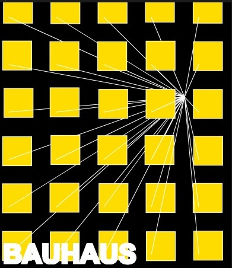
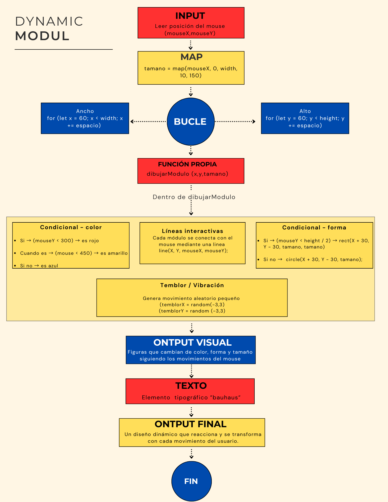

# Solemne-2---Pensamiento-Computacional
## Nombre del proyecto: Dynamic Modul

 

[link](https://editor.p5js.org/Valentinaelizondo/sketches/422oiG4fp) 

## Autor/a: Valentina Elizondo Pizarro

*Descripción objetiva*

**Qué es el proyecto** 

El proyecto consiste en un diseño interactivo que responde al movimiento del mouse, proyectando líneas a partir de su posición. Durante la interacción, estos elementos cambian de color, forma y tamaño, manteniendo un efecto de vibración constante que lo hace mucho más dinámico a la vista. 

**Qué se ve en pantalla** 

En la pantalla se presenta un lienzo de 800 x 900 px, organizado en una grilla de 5 columnas y 6 filas con una separación de 160 px entre sí. En este espacio se visualizan figuras geométricas planas con los colores primarios (rojo, azul y amarillo), inspiradas en la escuela de diseño Bauhaus.
Cada módulo está anclado a una línea blanca que converge hacia la posición del cursor. Al mover el mouse por el lienzo, las líneas experimentan un efecto de elasticidad y deformación. Asimismo, los módulos reaccionan al movimiento del usuario: al desplazarse a la derecha aumentan de tamaño, al bajar cambian de color, y en la parte inferior se transforman en circunferencias azules. Además, todos los módulos mantienen un efecto de vibración constante.
Por último, en la parte inferior izquierda se aprecia un texto fijo en color blanco, cuyo estilo también está inspirado en las obras de la Bauhaus.

**Qué elementos visuales aparecen**

Los elementos visuales principales son figuras geométricas planas, como cuadrados y círculos, que se transforman al mover el cursor. Estas figuras varían de color según su posición en el lienzo: el rojo se ubica en la parte superior, el amarillo en el centro y el azul en la parte inferior. Además, cada elemento está anclado desde su centro a una línea, generando una convergencia que sigue la posición del mouse.
En la parte inferior izquierda se visualiza un texto fijo con la palabra “BAUHAUS” en color blanco, se utiliza una tipografía bold (negrita) con un contorno del mismo color, lo que le aporta mayor grosor y jerarquía visual.

**Qué inputs utiliza** 

- MouseX (Posición X del mouse): Controla de forma dinámica el tamaño de las figuras (gracias a la función map) y hacia dónde se dirigen horizontalmente las líneas interactivas.
- MouseY (Posición Y del mouse): Funciona para dos cosas:
  
•	El color: Si está arriba es rojo, en medio es amarillo, y abajo es azul.

•	La forma: Si está en la mitad superior del lienzo dibuja cuadrados (rect), y si pasa a la mitad inferior dibuja círculos (circle). También define el punto de destino vertical de las líneas.

**Qué outputs genera**

**Lienzo** : Un lienzo color negro de 800 x 900 píxeles (createCanvas(800, 900) y background(0,0,0)).

**La Grilla de Módulos**: Un patrón repetido de figuras geométricas que cambian constantemente de tamaño, color (rojo, amarillo o azul), forma (cuadrado o círculo) según te mueves y vibran aleatoriamente 

**Líneas Interactivas**: Una red de líneas blancas (line) que se extienden desde el centro de cada módulo de la grilla y persiguen al cursor a donde quiera que vaya.

**Texto**: La palabra "BAUHAUS" pintada en blanco, en tipografía bold y tamaño 90px en la esquina inferior izquierda.

*Descripción conceptual*

**Idea central del proyecto**

La propuesta se inspira en la estética de la escuela de diseño Bauhaus, retomando su paleta de colores primarios y el uso de figuras geométricas clásicas. El proyecto está diseñado para que el usuario interactúe directamente con la pieza. A diferencia de las composiciones estáticas tradicionales de la Bauhaus, esta propuesta incorpora comportamiento dinámico e interacción en tiempo real, incorpora transformaciones constantes en cada uno de sus módulos. Estos elementos siguen el movimiento del cursor para potenciar la interactividad, logrando que la obra se perciba visualmente viva y dinámica.

**Corriente o referente de diseño con el que dialoga**

El referente principal es la escuela de diseño Bauhaus. El proyecto dialoga con esta corriente a partir del uso de sus colores primarios y de figuras geométricas básicas, como el círculo y el cuadrado.

**Listado y breve descripción de referentes visuales, teóricos o históricos**

El proyecto está inspirado en la Bauhaus, tomando elementos característicos como el uso de colores primarios, formas geométricas y composiciones modulares.
El principal referente visual e histórico fue el póster realizado por Joost Schmidt para la exposición de la Bauhaus de 1923. De este referente se tomó la estructura en grilla y la organización cromática mediante bloques de color divididos en secciones, buscando mantener una composición visualmente ordenada.
Otro referente utilizado fue un póster abstracto geométrico inspirado en el estilo Bauhaus. De este se rescató principalmente el tratamiento tipográfico y la jerarquía visual del texto.

 

Referente Joost Schmidt 

 

Referente

**Principio de diseño explorado**

Composición modular inspirada en la Bauhaus, basada en el uso de geometría simple, colores primarios y repetición en grilla. El proyecto explora la interactividad mediante variaciones de tamaño, color y forma controladas por la posición del mouse, generando una composición dinámica y cambiante. Además, se incorporan líneas interactivas y vibraciones para aportar movimiento y mayor dinamismo visual a la composición.

*Input / Output y sistema*

**Reglas que gobiernan el sistema (inputs, procesos, outputs)**

*Reglas de los Inputs*

- Posición Horizontal (mouseX): Captura un número entre 0 y 800 que indica la coordenada X del cursor.
- Posición Vertical (mouseY): Captura un número entre 0 y 900 que indica la coordenada Y del cursor.

*Reglas de los Procesos*

- Regla de Proporción (Función map)
Toma el input mouseX (que va de 0 a 800) y lo remapea proporcionalmente a una nueva escala de tamaño entre 10 y 120 píxeles, como resutado el mouse que va a la izquierda, el tamaño va a ser del mínimo 10; si está a la derecha, su máximo es 120.

- Reglas de Bucles
El sistema calcula un tipo grilla rígida. Empieza en X = 50 e Y = 50, y va sumando de 160 en 160 píxeles (espacio = 160) hasta llegar al borde de la pantalla.

- Reglas de Condicionales (if / else / else if)
•	Para el Color:
o	Si → mouseY es menor a 280 → El color es Rojo (255, 0, 0).
o	Cuando es → mouseY está entre 280 y 450 → El color es Amarillo (255, 220, 0).
o	Si no → mouseY es mayor a 450 → El color es Azul (0, 100, 255).
•	Para la Forma:
o	Si → mouseY está en menos de 450 → Se decide procesar un Cuadrado.
o	Si no → mouseY está en 450 o más → Se decide procesar un Círculo.

- Regla de la función random:
Si sale un número positivo (como 1, 2 o 3): La figura da pequeños pasos hacia la derecha (en el eje X) o hacia abajo (en el eje Y). Si sale un número negativo (como -1, -2 o -3): La figura da pequeños pasos hacia la izquierda (en el eje X) o hacia arriba (en el eje Y). Como random(-3, 3) elige un número al azar y lo hace 60 veces por segundo

*Reglas de los Outputs*

- Regla de las formas temblorosas:
Las figuras geométricas (cuadrados o círculos) se dibujan desfasadas de la grilla original por una distancia fija, más un valor aleatorio generado por random(-3,3) que produce un efecto de vibración visual. El tamaño final de las figuras está determinado por la función map(mouseX, 0, width, 10, 120), permitiendo que cambien dinámicamente según la posición horizontal del cursor.

- Regla de transformación de formas:
El sistema decide qué figura dibujar dependiendo de la posición vertical del mouse (mouseY). Cuando el cursor se encuentra en la mitad superior de la pantalla, aparecen cuadrados (rect). Cuando el cursor baja hacia la mitad inferior, las formas se transforman en círculos utilizando (circle).

- Regla Cromática:
El color de las figuras cambia según la posición vertical del cursor. Si el mouse está en la zona superior, las figuras se colorean de rojo; en la zona media cambian a amarillo; y en la zona inferior pasan a azul.

- Regla de las líneas:
Se dibuja una línea blanca de 2 píxeles de grosor desde cada intersección fija de la grilla matemática (X,Y) hasta la posición exacta actual del cursor (mouseX, mouseY). Estas conexiones generan una red visual interactiva que cambia continuamente según el movimiento del usuario.

-	Regla del texto
El texto "BAUHAUS" se dibuja fijo en el lienzo, siempre se organiza en la parte inferior izquierda del lienzo, en color blanco, con tipografía en bold y borde de 6 píxeles, ignorando completamente el movimiento del mouse y las variaciones aleatorias.

**Explicación del sistema de interactividad**

El sistema de interactividad del proyecto se basa en la posición y el movimiento del mouse dentro del lienzo. Mediante la función map(), el eje horizontal (mouseX) controla dinámicamente el tamaño de los módulos: en la parte izquierda del lienzo las figuras alcanzan aproximadamente 10 px, mientras que al desplazarse hacia la derecha aumentan progresivamente hasta llegar a los 120 px.
Por otro lado, el eje vertical (mouseY) controla tanto el color como la forma de los módulos. En la zona superior predominan figuras rojas, en la zona central amarillas y en la parte inferior azules. Además, cuando el cursor se encuentra en la mitad superior del lienzo se generan cuadrados, mientras que en la mitad inferior estos se transforman en círculos.
Cada módulo está conectado mediante líneas blancas que convergen constantemente hacia la posición del cursor, siguiendo su movimiento en tiempo real y generando una sensación de dinamismo y tensión visual. Asimismo, las figuras incorporan pequeños desplazamientos aleatorios que producen un efecto de vibración continua

**Qué datos entran**

- MouseX (Coordenada X del cursor): Registra el movimiento de izquierda a derecha. Modifica de forma directa el tamaño de las figuras y el destino de las líneas.
- MouseY (Coordenada Y del cursor): Registra el movimiento de arriba a abajo. Funciona como el interruptor que cambia los colores y define si se dibujan cuadrados o círculos.
- Random(-3, 3): Valor aleatorio aplicado constantemente a la posición de cada módulo para generar un efecto visual de vibración dentro de la composición.

**Cómo se procesan y transforman**

Los datos generados por el movimiento del mouse son procesados en tiempo real a medida que el usuario interactúa con la composición.
La función map() transforma el valor horizontal de mouseX en distintos tamaños para las figuras, permitiendo que estas aumenten progresivamente a medida que el cursor se desplaza hacia la derecha.
Posteriormente, mediante condicionales (if, else if y else), el sistema interpreta la posición vertical del cursor (mouseY) para decidir el color y la forma de cada módulo. Dependiendo de la zona del lienzo en la que se encuentre el mouse, los módulos cambian entre rojo, amarillo y azul, además de alternar entre cuadrados y círculos.
Finalmente, valores aleatorios (random) generan un efecto constante de vibración visual. Todos estos procesos se actualizan continuamente dentro del ciclo draw(), permitiendo una interacción dinámica en tiempo real.

**Qué respuesta visual producen**

El sistema genera una composición visual interactiva y dinámica inspirada en la Bauhaus. Como respuesta al movimiento del mouse, los módulos modifican continuamente su tamaño, color y forma dentro de la grilla.
Cuando el cursor se desplaza horizontalmente, las figuras aumentan o disminuyen de tamaño; mientras que el movimiento vertical provoca cambios cromáticos entre rojo, amarillo y azul, además de transformar los cuadrados en círculos en la parte inferior del lienzo.
Simultáneamente, líneas blancas conectan cada módulo con la posición del cursor, creando una sensación de convergencia y movimiento constante. A esto se suma un efecto de vibración generado mediante variaciones aleatorias en la posición de las figuras, lo que aporta mayor dinamismo visual.

**Diagrama de flujo**

 

